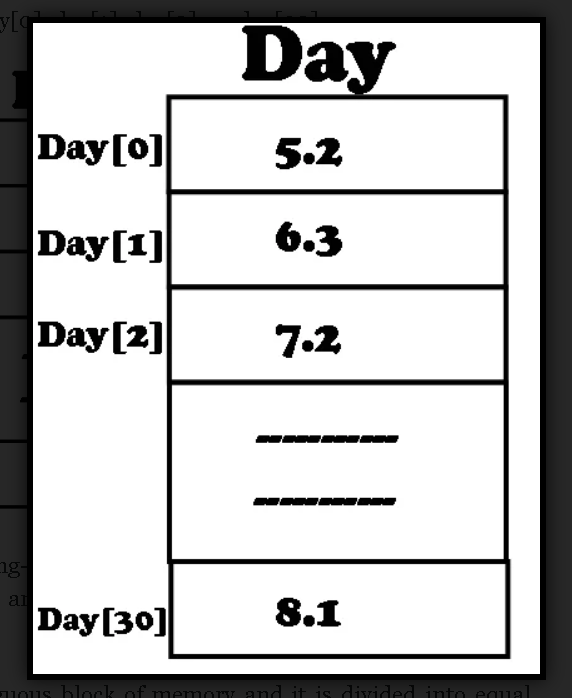

**One-Dimensional JavaScript array:**
One-dimensional Js array is also known as a linear array. It consists of only one row or one column. For example, the temperature of each day of a month is stored in an array. The name of the array is “day” and its elements are day[0], day[1], day[2],—-,day[30].

The above array name “day” contains floating-point data ( or real data). It has 31 elements. The day[0] is the first element of the Js array and its value is 5.2. Similarly, day[30] is the last element of the Js array and its value is 8.1.

We know that a Js array occupies a contiguous block of memory and it is divided into equal parts. Each part of the memory block represents one element of the Javascript array. In JavaScript, elements are numbered from 0 to n-1. The ‘n’ represents the total number of elements of the Js array.

**Declaring One-Dimensional Js array:**
Like other variables in JavaScript, an array must be declared before it is used. Defining the name of Js array and its total number of elements is called declaring of the array. When a Javascript array is declared, a memory block with the required number of consecutive locations is reserved in the computer memory for storing data.

In JavaScript, the new operator is used to create an array. Actually, this operator is used to create a new object. JavaScript considers the array to be an object data type.

========================================
**Techniques for declaring Js array:**
There are two techniques that are used to declared the Js array.

**First method:**

In this way, the size of the Js array is specified at the time of its declaration. The general syntax to declare a Js array using this method is:

ArrayName= new Array(size);

Where:
**ArrayName:**

Specifies the name of the array.

**Array:**

It is the keyword of JavaScript.

**Size:**

Specifies the size of the array i.e. number of elements in the array.

For example, to declare an array “xyz” of size 10, the statement is written as;

Xyz= new array(10);

**Second Method:**

In this way, the Js array is declared without specifying its size. The size of the Js array is zero. The general syntax to declare a Js array  using this method is:

ArrayName = new Array();

In this technique, JavaScript automatically extends the size to an array when new Js array elements are initialized. For example, the following statements create an array “arr” of size 0 and then extend the sizes of this  array to 50 and then 500:

arr= new Array();

arr[49]= 345;

arr[499]= 925;

please note that if the size of the array is specified at the time of its declaration, its size can also be extended. This is done in the same way as with zero-size array . For example, the following statement creates a Js array  “abc” of size 10 and then extend the size of this array to 30:

abc= new Array(10);

abc[29] = 139;

in the above statement “abc[29] = 139”, the size of array “abc” is extended by referencing its element 29 which is outside the actual size specified.

============================================

**Using One-Dimensional Js array:**
The Js array is used to process a large amount of data. Each element of an array is accessed by specifying the name of Js array and its index value. you can store data in an array using an input statement with the help of a loop structure. The index value of the array is changed through a loop statement. You can input data into elements of Js array or display data elements of the array. Similarly, you can search for a particular value from the array. The values of the array can also be sorted. Before, to perform different operations on an array, first of all, values are stored in an array.

================================================

**Storing values in a one-dimensional Js array:**
In JavaScript, once you have declared an array, it can be filled with values of any data types. The values are stored in a Js array using the assignment statement or input statement. In JavaScript, you can use “prompt” dialog box to input data into the elements of the array during the execution of the script.

You can also assign value to the individual elements of the array using an assignment statement. For example, to assign values to an array “temp” having 4 elements, the following assignment statements are used:

Temp[0] = 15;

Temp[1] = 20;

Temp[2] = 28;

Temp[3] = 30;

A JavaScript array may have several elements. Usually, the loop statement is used to access all elements of js array. A single assignment statement or input statement is used within the body of the loop to assign data to all elements by changing the index value.

For example, to fill all the elements of Js array “abc” with value 50, the program is written as:

**Example write JavaScript code to input values into individual elements of an array during the execution of the script and display the values of Js array:**

<html>
<body>

</body>
</html>

**Displaying Data from Js array:**
The output statements are used to display the contents to a Js array. In JavaScript, you can display the contents of an array using “document.write()” command, alert and confirm dialog boxes.

**For example, to assign values to array “abc” and to display the contents of the array in the browser’s window, the code is given below:**

<html>
<body>

</body>
</html>

In the above code, the assignment statements are used to assign values to the elements of the JavaScript array. Similarly, the output statement is used inside the for loop structure to print the value of all elements of Js array “temp”.

**Example: write JavaScript code to enter integer type data into an array and then to print the values in reverse order:**

<html>
<body>

</body>
</html>

**Example: write JavaScript code to enter values into a one-dimensional array. Find out the total number of odd and even values enter into a one-dimensional array:**

<html>
<body>

</body>
</html>

**Dense Js Array:**
In JavaScript, an array that is declared and initialized with values at the time of its declaration is called a dense Js array. In other programming languages, assigning values to the elements of the array at the time of its declaration is called array initialization. A dense Js array is used exactly in the same manner as other arrays.

The general syntax to create a dense Js array is;

Arrayname = new Array(list of values);

In the above syntax, “list of values” represents the list of constant values separated by commas.

For example, an array containing three values is created as follows:-

abc = new Array(‘english’ , ‘math’ , ‘computer’);

the size of the above array  will be 3. You can modify the size of the above array.

**Example: write JavaScript code to initialize values 2, 6, 7, 8, 4, and 3 in one-dimensional array which compute the factorial of the values of each element of Js array and print the result:**

<html>
<body>

</body>
</html>